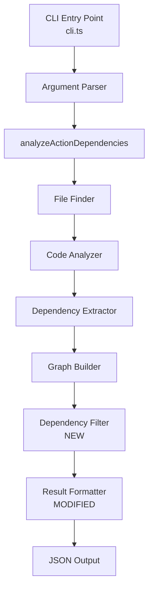
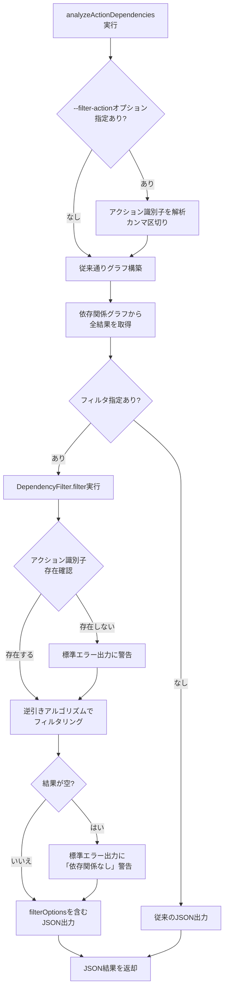
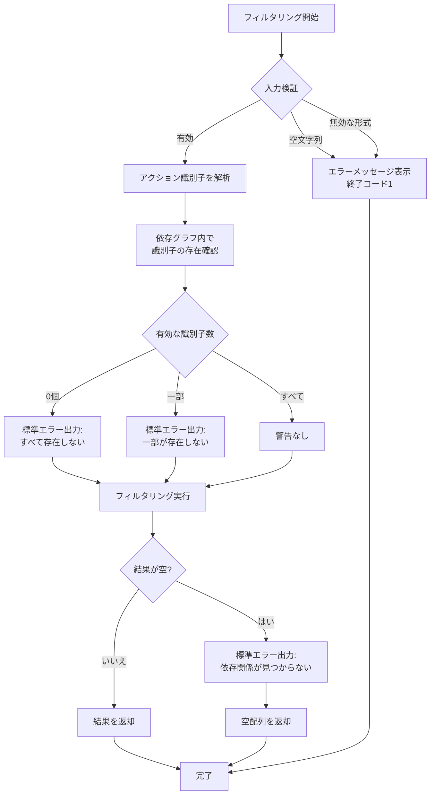

# 技術設計書

## 概要

本機能は、既存の`bm-action-dep-parser`に対し、アクション識別子によるフィルタリング機能を追加します。開発者は`--filter-action`オプションを使用して特定のアクションに関連するビューやJavaScriptアクションのみを抽出でき、大規模プロジェクトにおける変更影響範囲の分析とリファクタリング作業を効率化します。

**目的**: 特定アクションに依存するコンポーネントのみを抽出し、ノイズを排除した依存関係解析を提供します。

**対象ユーザー**: BaseMachinaプラットフォーム上でアプリケーション開発を行う開発者、特にリファクタリングや変更影響範囲分析を頻繁に行うエンジニア。

**影響範囲**: 既存の解析パイプラインに後処理フィルタステージを追加します。JSON出力形式は一切変更せず、既存のAPIと完全に後方互換性を維持します。

### ゴール

- アクション識別子による依存関係のフィルタリング機能を提供
- CLIオプション`--filter-action`で単数・複数のアクション識別子を受け付ける
- ビュー解析・アクション解析の両方でフィルタリングをサポート
- JSON出力形式を完全に維持（配列形式、フィルタ有無で同一）
- 既存機能との完全な後方互換性を維持

### 非ゴール

- フィルタ結果のキャッシング機能（将来的な拡張として検討可能）
- 正規表現やワイルドカードによるアクション識別子のパターンマッチング
- フィルタリング以外の新しい解析機能（例：循環依存検出）
- JSON以外の出力フォーマット（テキスト、GraphVizなど）

## アーキテクチャ

### 既存アーキテクチャの分析

現在の`bm-action-dep-parser`は、以下のパイプライン処理パターンを採用しています：

```
ファイル検索 → AST生成 → 依存関係抽出 → グラフ構築 → 結果整形
(file-finder) (code-analyzer) (dependency-extractor) (graph-builder) (result-formatter)
```

**既存の主要コンポーネント**:
- **ViewDependencyGraph**: ビューファイル間の依存関係グラフを管理し、`getReachableActionDependencies()`でエントリーポイントから到達可能なアクション依存関係を返す
- **ActionDependencyGraph**: アクションファイル間の依存関係グラフを管理し、同様に到達可能性分析を提供
- **analyzeActionDependencies()**: メイン解析ロジック。ターゲットタイプに応じてグラフを構築し、結果を返す
- **cli.ts**: CLI引数の解析とコマンド実行のエントリーポイント

**既存のドメイン境界**:
- ファイル検索層（`lib/file-finder.ts`）
- AST解析層（`lib/code-analyzer.ts`, `lib/dependency-extractor.ts`）
- グラフ構築層（`lib/dependency-graph-builder.ts`, `lib/action-dependency-graph-builder.ts`）
- エントリーポイント分析層（`lib/entry-point-analyzer.ts`）
- 結果フォーマット層（`lib/result-formatter.ts`）

### 高レベルアーキテクチャ



**新規コンポーネント統合の理念**:
- **フィルタリングは後処理**: グラフ構築後、結果整形前にフィルタリングを適用することで、既存のグラフ構築ロジックに変更を加えません
- **単一責任の原則**: 新しい`DependencyFilter`クラスはフィルタリングのみを担当し、グラフ構築や解析ロジックとは分離
- **依存関係の方向**: 低レベル（グラフ構築）→ 高レベル（フィルタリング）への依存方向を維持

### 技術スタックとの整合性

本機能は既存システムへの拡張であり、新たな技術スタックの導入はありません。

**既存技術スタックとの整合性**:
- TypeScript 5.8.3を継続使用
- TypeScript Compiler APIによるAST解析パターンを維持
- Node.js標準ライブラリのみを使用（新規外部依存なし）
- 厳格な型チェック（`strict: true`）を維持

**新規導入ライブラリ**: なし

**ステアリング準拠**:
- `structure.md`に従い、`lib/`ディレクトリに`dependency-filter.ts`を追加
- `tech.md`に従い、TypeScript Compiler APIと単一責任の原則を遵守
- `product.md`に従い、CLI引数による柔軟な設定と機械可読なJSON出力を維持

### 主要な設計判断

#### 判断1: フィルタリングのタイミング - 後処理vs.グラフ構築時

**決定**: フィルタリングをグラフ構築後の後処理として実装

**コンテキスト**: フィルタリングは既存の依存関係グラフに基づいて結果をフィルタするため、グラフ構築時に組み込むか、グラフ構築後に適用するかの選択肢があります。

**代替案**:
1. **グラフ構築時にフィルタ**: `ViewDependencyGraph`/`ActionDependencyGraph`内部でフィルタ条件を受け取り、グラフ走査時に不要なノードをスキップ
2. **後処理としてフィルタ**: グラフ構築後、`analyzeActionDependencies()`内で結果をフィルタリング
3. **結果整形時にフィルタ**: `result-formatter.ts`内でフィルタリングロジックを実装

**選択したアプローチ**: 後処理としてフィルタ（選択肢2）

`analyzeActionDependencies()`関数内で、グラフから取得した結果を新しい`DependencyFilter`クラスに渡し、フィルタリングされた結果を返します。

**理由**:
- **既存コードへの影響最小化**: グラフ構築クラス（`ViewDependencyGraph`, `ActionDependencyGraph`）を変更せず、単一責任の原則を維持
- **テスト容易性**: フィルタリングロジックを独立したクラスとして分離することで、ユニットテストが容易
- **柔軟性**: 将来的に複数のフィルタ条件（例：ファイルパスパターン）を追加する際に拡張しやすい

**トレードオフ**:
- **利点**: コードの分離性向上、既存ロジックの安定性維持、テストのしやすさ
- **欠点**: グラフ全体を構築してからフィルタするため、大規模プロジェクトではわずかなメモリオーバーヘッド（ただし、現実的なプロジェクトサイズでは無視できるレベル）

#### 判断2: フィルタリングアルゴリズム - 逆引きvs.順引き

**決定**: 逆引きアルゴリズム（指定されたアクションに依存するコンポーネントを探索）

**コンテキスト**: ユーザーが`--filter-action sampleAction`を指定した場合、`sampleAction`に依存するビュー・アクションを特定する必要があります。

**代替案**:
1. **逆引き（逆方向探索）**: 指定されたアクションをターゲットとし、そのアクションに依存するコンポーネントを探索
2. **順引き（順方向探索）**: 全エントリーポイントから探索を開始し、指定されたアクションに到達するパスを特定

**選択したアプローチ**: 逆引き（逆方向探索）

依存関係グラフを逆転させ、指定されたアクション識別子をキーとして、それを直接・間接的に参照するエントリーポイントを特定します。

**理由**:
- **効率性**: 特定のアクション識別子から開始するため、不要なエントリーポイントの走査を回避
- **明確なセマンティクス**: 「このアクションに依存しているものは何か？」という質問に直接対応
- **スケーラビリティ**: エントリーポイント数が多いプロジェクトでも、フィルタ対象のアクション数が少なければ効率的

**トレードオフ**:
- **利点**: フィルタ対象が少数の場合に高速、意図が明確
- **欠点**: グラフの逆転が必要（ただし、グラフサイズは通常数百〜数千ノード程度で、逆転コストは無視可能）

#### 判断3: 複数アクション指定時の論理 - ANDvs.OR

**決定**: OR論理（いずれかのアクションに依存するコンポーネントを抽出）

**コンテキスト**: `--filter-action action1,action2`のように複数のアクション識別子が指定された場合の動作。

**代替案**:
1. **OR論理**: `action1`または`action2`のいずれかに依存するコンポーネントを結果に含める
2. **AND論理**: `action1`と`action2`の両方に依存するコンポーネントのみを結果に含める

**選択したアプローチ**: OR論理

複数のアクション識別子が指定された場合、それらのいずれかに依存するコンポーネントをすべて結果に含めます。

**理由**:
- **ユースケースとの整合性**: 変更影響範囲分析では、「`action1`または`action2`のいずれかが変更された場合、影響を受けるコンポーネントは？」という質問が一般的
- **使いやすさ**: AND論理が必要な場合、ユーザーは2回のコマンド実行と手動での結果の交差を行えばよい（逆は困難）
- **一般的なフィルタリングの慣習**: SQLの`WHERE column IN (value1, value2)`やJavaScriptの`includes()`など、多くのフィルタリングAPIはOR論理を採用

**トレードオフ**:
- **利点**: 変更影響範囲分析の主要ユースケースに適合、使いやすさ
- **欠点**: AND論理が必要な場合は複数回のコマンド実行が必要（ただし、そのようなユースケースは稀）

## システムフロー

### フィルタリング処理フロー



### エラーハンドリングフロー



## 要件トレーサビリティ

| 要件 | 要件概要 | コンポーネント | インターフェース | フロー |
|------|---------|------------|------------|-----|
| 1.1 | --filter-actionオプション処理 | CLI引数パーサー, DependencyFilter | `parseFilterActionOption()`, `filter()` | フィルタリング処理フロー |
| 1.2 | 存在しないアクション識別子の警告 | DependencyFilter | `validateActionIdentifiers()` | エラーハンドリングフロー |
| 1.3 | 複数アクション識別子のサポート（カンマ区切り） | CLI引数パーサー | `parseFilterActionOption()` | フィルタリング処理フロー |
| 1.4 | フィルタなしの場合の従来動作維持 | analyzeActionDependencies | 既存ロジック（変更なし） | フィルタリング処理フロー |
| 2.1 | ビュー解析でのフィルタリング | DependencyFilter | `filterViewDependencies()` | フィルタリング処理フロー |
| 2.2 | フィルタされたビューの依存パス表示 | DependencyFilter | `filterViewDependencies()` | フィルタリング処理フロー |
| 2.3 | 部分一致時の依存関係抽出 | DependencyFilter | `filterViewDependencies()` | フィルタリング処理フロー |
| 3.1 | アクション解析でのフィルタリング | DependencyFilter | `filterActionDependencies()` | フィルタリング処理フロー |
| 3.2 | フィルタされたアクションの依存パス表示 | DependencyFilter | `filterActionDependencies()` | フィルタリング処理フロー |
| 3.3 | フィルタ対象アクション自身を結果に含める | DependencyFilter | `filterActionDependencies()` | フィルタリング処理フロー |
| 4.1 | JSON出力形式の維持 | Result Formatter | 既存フォーマット関数（変更なし） | フィルタリング処理フロー |
| 4.2 | フィルタ有無で同一のJSON形式 | analyzeActionDependencies | 既存ロジック（変更なし） | - |
| 4.3 | 後方互換性の完全維持 | Result Formatter | 既存フォーマット関数（変更なし） | フィルタリング処理フロー |
| 5.1 | 存在しないアクション識別子の警告 | DependencyFilter | `validateActionIdentifiers()` | エラーハンドリングフロー |
| 5.2 | フィルタリング結果が空の場合の警告 | DependencyFilter | `filter()` | エラーハンドリングフロー |
| 5.3 | 無効な入力形式のエラー処理 | CLI引数パーサー | `parseFilterActionOption()` | エラーハンドリングフロー |
| 5.4 | 一部のみ存在する場合の部分実行 | DependencyFilter | `validateActionIdentifiers()` | エラーハンドリングフロー |
| 6.1 | オプションなしの場合の出力形式維持 | analyzeActionDependencies | 既存ロジック（変更なし） | フィルタリング処理フロー |
| 6.2 | 既存オプションとの組み合わせ対応 | CLI引数パーサー | 既存のオプション解析ロジック | - |
| 6.3 | プログラムAPIの後方互換性 | analyzeActionDependencies | オプショナルパラメータ追加 | - |

## コンポーネントとインターフェース

### CLI層

#### CLIArgumentParser (cli.ts拡張)

**責任と境界**
- **主要責任**: コマンドライン引数を解析し、`--filter-action`オプションを抽出
- **ドメイン境界**: CLI層（ユーザーインターフェース）
- **データ所有**: コマンドライン引数の解析結果
- **トランザクション境界**: 単一の引数解析処理（副作用なし）

**依存関係**
- **インバウンド**: なし（エントリーポイント）
- **アウトバウンド**: `analyzeActionDependencies()`関数
- **外部**: Node.js `process.argv`

**契約定義**

既存のCLI引数解析ロジックを拡張：

```typescript
// 既存の引数解析ロジックに以下を追加
let filterActionIdentifiers: string[] | undefined = undefined;

for (let i = 2; i < args.length; i++) {
    const arg = args[i];
    if (arg === '--filter-action' && i + 1 < args.length) {
        const identifiersArg = args[i + 1];
        if (!identifiersArg || identifiersArg.trim() === '') {
            console.error('エラー: --filter-action オプションには少なくとも1つのアクション識別子を指定してください');
            process.exit(1);
        }
        filterActionIdentifiers = identifiersArg.split(',').map(id => id.trim()).filter(id => id !== '');
        if (filterActionIdentifiers.length === 0) {
            console.error('エラー: --filter-action オプションには有効なアクション識別子を指定してください');
            process.exit(1);
        }
        i++;
    }
    // 既存のオプション解析（--entry-point-patterns等）は継続
}
```

**事前条件**:
- `process.argv`に有効なコマンドライン引数が含まれる
- `--filter-action`の引数が空文字列または無効な形式でない

**事後条件**:
- `filterActionIdentifiers`が`string[]`または`undefined`として設定される
- 無効な入力の場合は終了コード1でプロセスが終了

**不変条件**:
- `filterActionIdentifiers`配列内の各要素は空文字列でない

### フィルタリング層

#### DependencyFilter (lib/dependency-filter.ts)

**責任と境界**
- **主要責任**: 依存関係グラフの結果を指定されたアクション識別子でフィルタリング
- **ドメイン境界**: フィルタリング層（解析結果の後処理）
- **データ所有**: フィルタリングされた依存関係結果
- **トランザクション境界**: 単一のフィルタリング処理（冪等）

**依存関係**
- **インバウンド**: `analyzeActionDependencies()`関数
- **アウトバウンド**: なし（純粋な変換処理）
- **外部**: Node.js標準ライブラリのみ

**契約定義**

**サービスインターフェース**:

```typescript
interface DependencyFilterService {
  /**
   * ビュー依存関係をアクション識別子でフィルタリング
   * @param dependencies 全ビュー依存関係
   * @param actionIdentifiers フィルタ対象のアクション識別子（カンマ区切り）
   * @returns フィルタされたビュー依存関係と警告メッセージ
   */
  filterViewDependencies(
    dependencies: ViewDependency[],
    actionIdentifiers: string[]
  ): FilterResult<ViewDependency[]>;

  /**
   * アクション依存関係をアクション識別子でフィルタリング
   * @param dependencies 全アクション依存関係
   * @param actionIdentifiers フィルタ対象のアクション識別子
   * @returns フィルタされたアクション依存関係と警告メッセージ
   */
  filterActionDependencies(
    dependencies: JavaScriptActionDependency[],
    actionIdentifiers: string[]
  ): FilterResult<JavaScriptActionDependency[]>;
}

interface FilterResult<T> {
  /** フィルタリングされた結果 */
  filtered: T;
  /** 警告メッセージ（標準エラー出力用） */
  warnings: string[];
}
```

**事前条件**:
- `actionIdentifiers`配列が空でない
- `dependencies`が有効な依存関係オブジェクトの配列

**事後条件**:
- 返却される`filtered`は、指定されたアクション識別子のいずれかに直接または間接的に依存するエントリーポイントのみを含む
- `warnings`配列に、存在しないアクション識別子や空の結果に関する警告メッセージが含まれる

**不変条件**:
- フィルタリング処理は入力データを変更しない（純粋関数）
- 同一の入力に対して常に同一の出力を返す（冪等性）

**統合戦略**:
- **修正アプローチ**: `analyzeActionDependencies()`関数を拡張し、結果取得後にフィルタリングを適用
- **後方互換性**: `filterActionIdentifiers`パラメータをオプショナルとして追加
- **移行パス**: なし（即座に利用可能、既存の呼び出しは影響なし）

### 結果フォーマット層

#### ResultFormatter (lib/result-formatter.ts - 変更なし)

**責任と境界**
- **主要責任**: 解析結果をJSON形式に整形（従来通り）
- **ドメイン境界**: 結果フォーマット層（出力生成）
- **データ所有**: JSON文字列
- **トランザクション境界**: 単一のフォーマット処理（冪等）

**依存関係**
- **インバウンド**: `analyzeActionDependencies()`関数、CLI
- **アウトバウンド**: なし
- **外部**: Node.js `JSON.stringify`

**契約定義**

**既存インターフェース（変更なし）**:

```typescript
/**
 * 依存関係の解析結果をJSON形式でフォーマットする
 * @param dependencies 依存関係の配列
 * @returns JSON形式でフォーマットされた結果（配列形式）
 */
function formatJavaScriptActionDependencyAnalysisResult(
  dependencies: Record<string, string[]>
): string {
  // 既存のロジック（変更なし）
  return JSON.stringify(result, null, 2);
}

function formatViewDependencyAnalysisResult(
  entryPointDependencies: Record<string, {
    direct: string[];
    indirect: Record<string, string[]>;
  }>
): string {
  // 既存のロジック（変更なし）
  return JSON.stringify(result, null, 2);
}
```

**事前条件**:
- `dependencies`が有効な依存関係オブジェクトの配列

**事後条件**:
- 配列形式のJSON文字列を返す（フィルタ有無にかかわらず同一形式）

**不変条件**:
- フォーマット処理は入力データを変更しない

**統合戦略**:
- **修正アプローチ**: 変更なし
- **後方互換性**: 完全に維持（修正不要）
- **移行パス**: なし（既存コードそのまま使用）

## データモデル

### 論理データモデル

**新規型定義**:

```typescript
/**
 * フィルタリング結果
 */
interface FilterResult<T> {
  /** フィルタリングされた依存関係 */
  filtered: T;
  /** 警告メッセージ（標準エラー出力用） */
  warnings: string[];
}
```

**既存型の拡張なし**:

`ViewDependency`と`JavaScriptActionDependency`は変更しません。フィルタリングは、これらの配列をフィルタして返すのみです。

### データ契約と統合

**JSON出力スキーマ（フィルタなし・フィルタあり共通）**:

```json
[
  {
    "entrypoint": "pages/SortableFormPage.tsx",
    "dependencies": {
      "direct": ["sampleAction"],
      "indirect": {
        "components/SortableForm.tsx": ["anotherAction"]
      }
    }
  }
]
```

**フィルタ適用時の動作**:
- JSON出力形式は完全に同一（配列形式を維持）
- フィルタリングされた結果のみが配列に含まれる
- フィルタ情報はJSON出力には含めず、必要に応じて標準エラー出力に表示

**スキーマバージョニング戦略**:
- JSON出力形式は一切変更なし
- 既存のパーサーは完全に互換性を維持
- フィルタの適用有無はJSON出力からは判別不可（必要に応じてCLI引数ログで確認）

## エラーハンドリング

### エラー戦略

フィルタリング機能では、以下の3つのエラー戦略を採用します：

1. **入力検証エラー**: 即座に終了（終了コード1）
2. **部分的な失敗**: 警告を表示して処理継続
3. **結果が空**: 警告を表示して空配列を返却

### エラーカテゴリと対応

#### ユーザーエラー（4xx相当）

**無効な入力形式**:
- **条件**: `--filter-action`の引数が空文字列または無効
- **対応**: 標準エラー出力にエラーメッセージを表示し、終了コード1で終了
- **メッセージ**: `エラー: --filter-action オプションには有効なアクション識別子を指定してください`

**存在しないアクション識別子**:
- **条件**: 指定されたアクション識別子が依存グラフに存在しない
- **対応**: 標準エラー出力に警告を表示し、処理を継続（部分実行）
- **メッセージ**: `Warning: Action identifier 'nonexistent-action' not found in dependency graph`

**フィルタリング結果が空**:
- **条件**: 指定されたアクション識別子に依存するコンポーネントが存在しない
- **対応**: 標準エラー出力に警告を表示し、空配列を返却
- **メッセージ**: `No dependencies found for the specified action identifier(s)`

#### システムエラー（5xx相当）

フィルタリング機能自体は純粋な変換処理のため、システムエラーは発生しません。ただし、既存の解析パイプライン（ファイル読み込み、AST解析など）で発生するエラーは従来通り処理されます。

### モニタリング

**ログ出力**:
- 標準エラー出力に警告メッセージを出力
- 既存の`console.error()`を使用（新しいログライブラリは導入しない）

**健全性チェック**:
- フィルタリング処理後、結果の妥当性を簡易チェック（空配列でないか、各エントリーが有効な構造を持つか）

## テスト戦略

### ユニットテスト

**DependencyFilter（lib/dependency-filter.ts）**:
1. 単一のアクション識別子でのフィルタリング（ビュー依存関係）
2. 複数のアクション識別子でのフィルタリング（OR論理）
3. 存在しないアクション識別子の警告生成
4. 部分的に存在するアクション識別子の処理
5. フィルタリング結果が空の場合の警告生成

**CLIArgumentParser（cli.ts）**:
1. `--filter-action`オプションの正常な解析
2. 複数のアクション識別子（カンマ区切り）の解析
3. 空文字列入力のエラーハンドリング
4. 既存オプション（`--entry-point-patterns`）との組み合わせ

### 統合テスト

**analyzeActionDependencies関数**:
1. フィルタオプションありでのビュー解析（エンドツーエンド）
2. フィルタオプションありでのアクション解析（エンドツーエンド）
3. フィルタオプションなしでの従来動作の維持確認
4. 既存テストフィクスチャ（`tests/fixtures/`）を使用したフィルタリング

### E2Eテスト

**CLIコマンド実行**:
1. `bm-action-dep-parser view ./tests/fixtures/views --filter-action sampleAction`
2. `bm-action-dep-parser action ./tests/fixtures/actions --filter-action action1,action2`
3. 存在しないアクション識別子での警告メッセージ確認
4. フィルタリング結果のJSON出力形式検証

### パフォーマンステスト

**フィルタリング処理の性能**:
1. 1000エントリーポイント、100アクション識別子でのフィルタリング速度測定
2. メモリ使用量の確認（グラフ構築後のフィルタリングによるオーバーヘッド）

**目標性能**:
- 1000エントリーポイントのフィルタリングが1秒以内
- メモリオーバーヘッドが元のグラフサイズの10%以内

## セキュリティ考慮事項

**入力検証**:
- アクション識別子に含まれる特殊文字（例：パス区切り文字、シェルメタ文字）のサニタイズは不要（識別子は依存グラフ内の文字列との完全一致で使用され、ファイルパスやシェルコマンドには使用されない）

**インジェクション攻撃**:
- フィルタリング処理は純粋な文字列比較であり、動的なコード実行やファイルシステムアクセスは行わないため、インジェクション攻撃のリスクはありません

**機密情報の露出**:
- JSON出力に含まれる情報は、既存の解析結果と同じ（ファイルパスとアクション識別子）であり、新たな機密情報の露出はありません

## パフォーマンスとスケーラビリティ

### ターゲットメトリクス

**フィルタリング処理時間**:
- 100エントリーポイント: < 100ms
- 1000エントリーポイント: < 1秒
- 10000エントリーポイント: < 10秒

**メモリ使用量**:
- グラフ構築後のフィルタリングによる追加メモリ: < グラフサイズの10%

### スケーリングアプローチ

**現在のアプローチ**: メモリ内グラフ構築とフィルタリング

**スケーラビリティの限界**:
- グラフがメモリに収まる範囲（通常、数万ファイル程度まで対応可能）

**将来的な拡張**（非ゴール）:
- 段階的なフィルタリング（グラフ構築時にフィルタを適用し、不要なノードをスキップ）
- グラフのディスク永続化とインクリメンタル解析

### キャッシング戦略

**現在のアプローチ**: キャッシングなし（毎回フルスキャン）

**将来的な拡張**（非ゴール）:
- 依存関係グラフのキャッシュ
- 前回実行との差分検出

## 移行戦略

本機能は既存システムへの拡張であり、破壊的変更はありません。移行戦略は不要です。

### 段階的なロールアウト

**Phase 1: リリース**
- `--filter-action`オプションを追加
- 既存の動作は完全に維持（オプションなしでの実行は変更なし）

**Phase 2: ユーザーフィードバック収集**
- 実際のプロジェクトでの使用状況とフィードバックを収集
- パフォーマンス問題や使いにくさの特定

**Phase 3: 将来的な拡張（オプショナル）**
- 正規表現サポート
- フィルタ結果のキャッシング
- AND/OR論理の選択可能化

### ロールバックトリガー

以下の場合、機能を無効化またはロールバック：
- フィルタリング処理が10秒以上かかる場合が頻発
- メモリ使用量が通常の2倍以上になる場合
- 既存機能に影響を与える不具合が発見された場合

### 検証チェックポイント

**Phase 1完了時**:
- [ ] 全E2Eテストが通過
- [ ] 既存の全テストが引き続き通過（回帰テスト）
- [ ] ドキュメント（README.md、ヘルプメッセージ）が更新されている

**Phase 2完了時**:
- [ ] 少なくとも3つの実プロジェクトでの使用実績
- [ ] パフォーマンスメトリクスが目標値を満たしている
- [ ] ユーザーフィードバックで重大な問題が報告されていない
